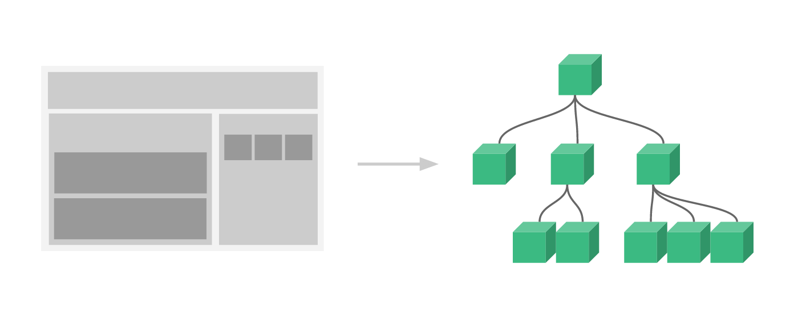

# 뷰 컴포넌트
---
- 컴포넌트는 화면의 영역을 구분하여 개발할 수 있는 뷰의 기능입니다. 컴포넌트 기반으로 화면을 개발하게 되면 코드의 재사용성이 올라가고 빠르게 화면을 제작할 수 있습니다.

[cracking vue.js](https://joshua1988.github.io/vue-camp/vue/components.html#%E1%84%8F%E1%85%A5%E1%86%B7%E1%84%91%E1%85%A9%E1%84%82%E1%85%A5%E1%86%AB%E1%84%90%E1%85%B3-%E1%84%89%E1%85%A2%E1%86%BC%E1%84%89%E1%85%A5%E1%86%BC-%E1%84%8F%E1%85%A9%E1%84%83%E1%85%B3-%E1%84%92%E1%85%A7%E1%86%BC%E1%84%89%E1%85%B5%E1%86%A8)