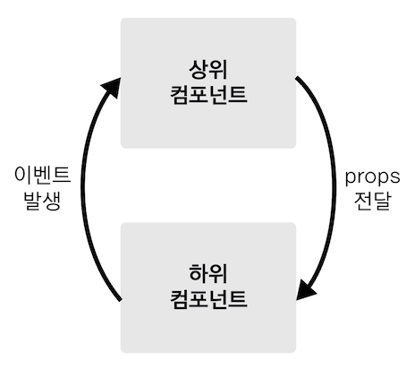

# 컴포넌트 통신 방식
* 뷰 컴포넌트는 각각 고유한 데이터 유효 범위를 갖습니다. 따라서, 컴포넌트 간에 데이터를 주고 받기 위해선 아래와 같은 규칙을 따라야 합니다.

* 상위 -> 하위; 데이터 내려줌 [프롭스 속성](https://joshua1988.github.io/vue-camp/vue/props.html)
* 하위 -> 상위; 이벤트 올려줌 [이벤트 발생](https://joshua1988.github.io/vue-camp/vue/event-emit.html)